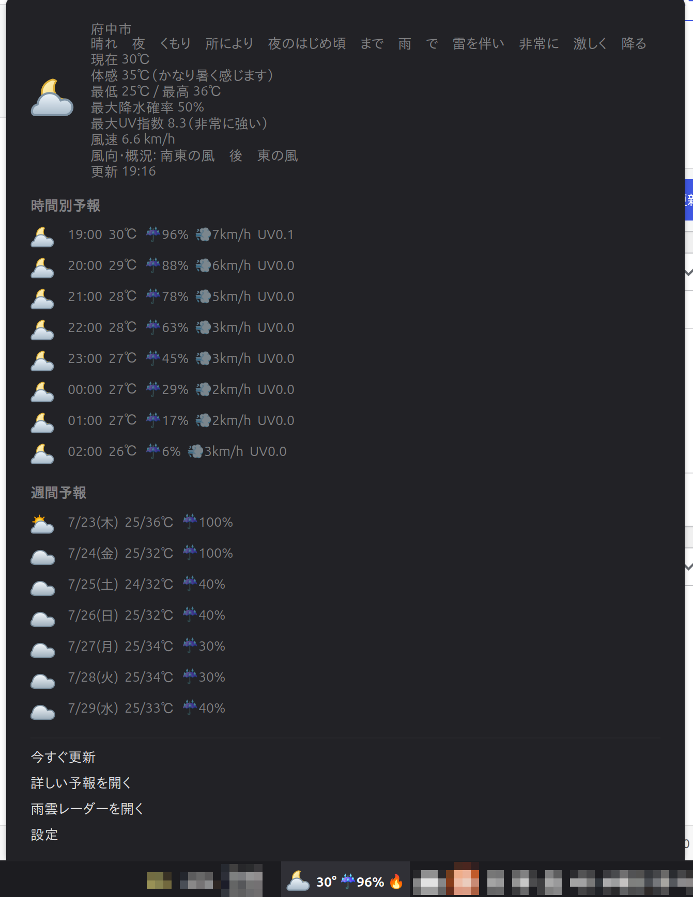
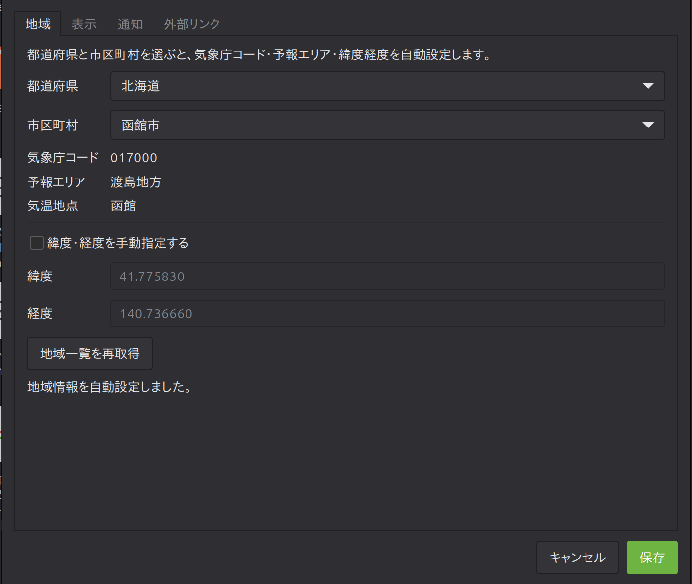

# JMA Weather Widget for Cinnamon 3.1.1

気象庁の公式予報とOpen-Meteoの補助データを表示する、Linux上のCinnamon desktop environment向け天気アプレットです。




> **正式版:** `3.1.1`では、v3.1.0のパネル同期機能を維持し、クリーンインストール後に設定画面が開かない問題を修正します。

## v3.1.1の主な変更

- 設定画面をディストリビューションの`/usr/bin/python3`で起動します
- クリーンインストール時に設定画面必須の`tools/location_catalog.py`を配置します
- pyenvなどのユーザー管理PythonがGTK用PyGObjectを持たない環境でも設定画面を起動できます
- 開発専用のリリースビルダーはアプレットのインストール先へ配置しません
- `screenshot_01.png`を現在時間に同期したパネル表示へ更新します

v3.1.0のパネルアイコン・降水確率同期、Provider構成、地域選択、通知、永続キャッシュ、片側障害時の継続表示、更新世代管理は維持されます。通常利用では単体の`gjs` CLIは不要です。

## v3アーキテクチャ

巨大化していた`applet.js`から、データ取得・解析・統合処理をProvider／Service／Modelへ分離しました。

```text
applet.js
    ↓
WeatherService
    ├── JmaProvider
    └── OpenMeteoProvider
            ↓
      WeatherSnapshot
            ↓
      Cinnamon UI・通知処理
```

## ディレクトリ構成

```text
settings.py
├── tools/
│   └── location_catalog.py
├── data/
│   └── area-fallback.json
└── src/
    ├── models/
    │   └── weatherData.js
    ├── providers/
    │   ├── jmaProvider.js
    │   └── openMeteoProvider.js
    ├── services/
    │   ├── cacheService.js
    │   ├── httpClient.js
    │   ├── iconService.js
    │   ├── locationService.js
    │   └── weatherService.js
    └── utils/
        └── weatherUtils.js
icons/
└── *.svg
```

## 機能

- 気象庁の公式JSONによる今日・週間予報
- Open-Meteoによる現在値・時間別予報・UV・体感温度・風速
- 現在時間の時間別予報に同期したパネルアイコンと降水確率
- 3～12時間分の時間別表示
- 雨・高温・UV通知
- API片方の取得に失敗した場合、もう片方と前回成功データを維持
- last-goodデータの永続キャッシュと起動時即時復元
- Providerごとの鮮度表示とキャッシュのみ状態での通知抑制
- 更新世代管理による多重通信・古い応答の反映防止
- timeout・HTTP・JSON・通信・解析エラー分類
- 都道府県・市区町村の連動選択
- 気象庁コード・予報エリア・緯度経度の自動設定
- 緯度経度の任意手動上書き
- 設定画面起動の互換フォールバック
- 同梱SVGによるパネル・現在・時間別・週間予報アイコン
- SVG欠損時のテーマアイコンフォールバック
- 現在天気・予報アイコンサイズ設定

## インストール

```bash
unzip jma-weather-widget-for-cinnamon-v3.1.1-github-ready.zip
cd jma-weather-widget-for-cinnamon-v3.1.1-github
./install.sh
```

通常利用のために`gjs`コマンドを追加インストールする必要はありません。将来はCinnamon Spicesからの導入も予定しています。

X11ではCinnamonを再読み込みします。

```text
Alt+F2
r
Enter
```

古いコードが残る場合は、パネルからアプレットを一度外して再追加してください。

## v3.1.0からの更新

アップグレードZIPを展開済みv3.1.0へ重ねてから再インストールします。既存の設定キー、インスタンスID、キャッシュ形式は変更されません。

```bash
unzip jma-weather-widget-v3.1.1-upgrade-from-v3.1.0.zip -d /path/to/jma-weather-widget-for-cinnamon
cd /path/to/jma-weather-widget-for-cinnamon
./install.sh
```

## キャッシュ保存先

```text
~/.cache/jma-weather@10yendama.com/weather-<instance-id>.json
```

`XDG_CACHE_HOME`が設定されている場合は、その配下へ保存されます。

## 開発者向けチェック

完全なテストには`gjs` CLIが必要です。これは開発時だけの依存関係です。

Ubuntu / Linux Mint:

```bash
sudo apt install gjs
```

```bash
./test.sh
```

実行内容:

- 全JavaScriptファイルの構文検査
- JSON検査
- Provider・WeatherSnapshotのスモークテスト
- 現在時間選択、日付変更、タイムゾーン、パネル値のResolverテスト
- CacheServiceの保存・復元・期限切れ・破損キャッシュテスト
- Provider部分障害・全障害のレジリエンステスト
- 更新世代管理とエラー分類の静的検査
- SVG XML検査とIconServiceマッピングテスト
- 地域カタログ解析のスモークテスト
- Python設定画面の構文検査
- 正式版バージョン表記の整合性検査
- GJSでのモジュール読み込み検査
- インストールとローカル／CI依存分岐の検査

GitHub Actionsでも同じテストを実行します。リリース成果物は、比較元タグを指定して一括生成・検証できます。

```bash
tools/build-release.sh --base-tag v3.0.1
```

成果物は既定で`dist/`へ出力されます。スクリプトはGitHub-ready ZIPの展開後テスト、upgrade ZIPとGit binary patchの適用比較、禁止ファイル検査、SHA256照合まで実行します。

## 対応環境

- Linux上のCinnamon desktop environment
- Tested on Linux Mint / Cinnamon 6.6 / GJS 1.80 / X11

## データソース

- 今日・週間予報: 気象庁
- 現在値・時間別予報・UV: Open-Meteo

## ログ確認

```text
Alt+F2 → lg → Enter
```

または:

```bash
journalctl --user -f | grep -i jma-weather
```

## License

MIT
