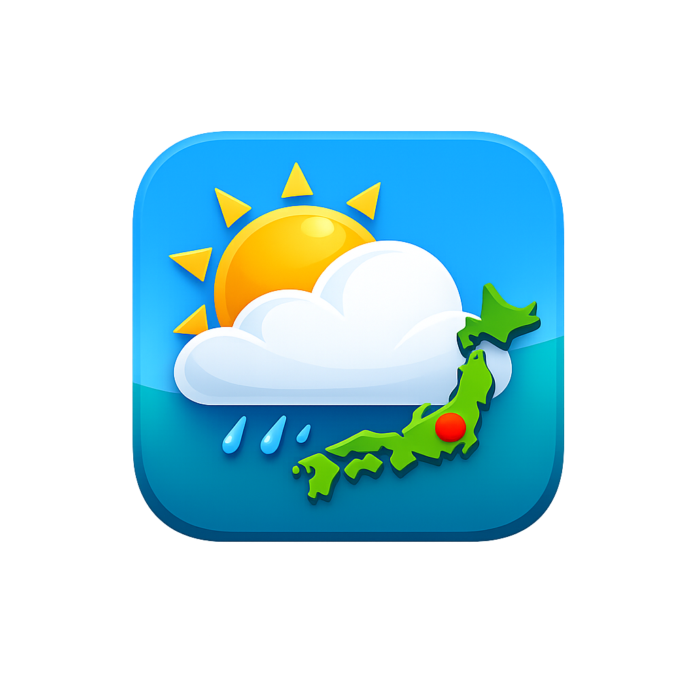
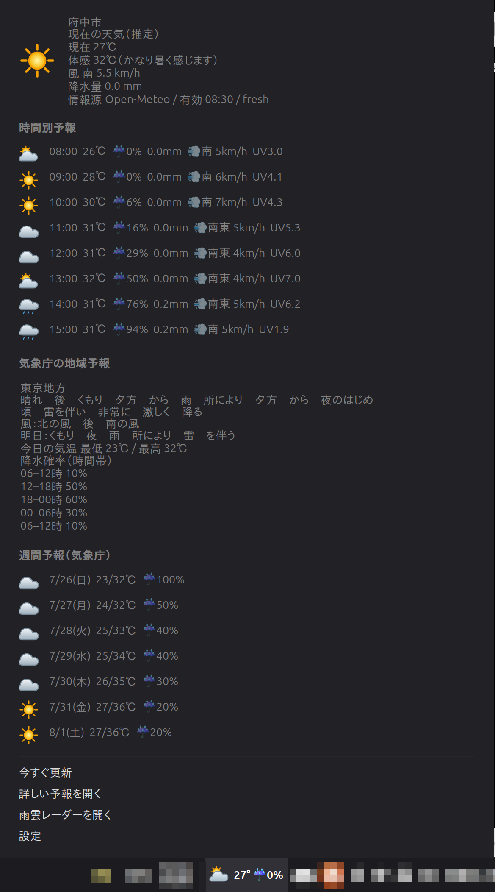
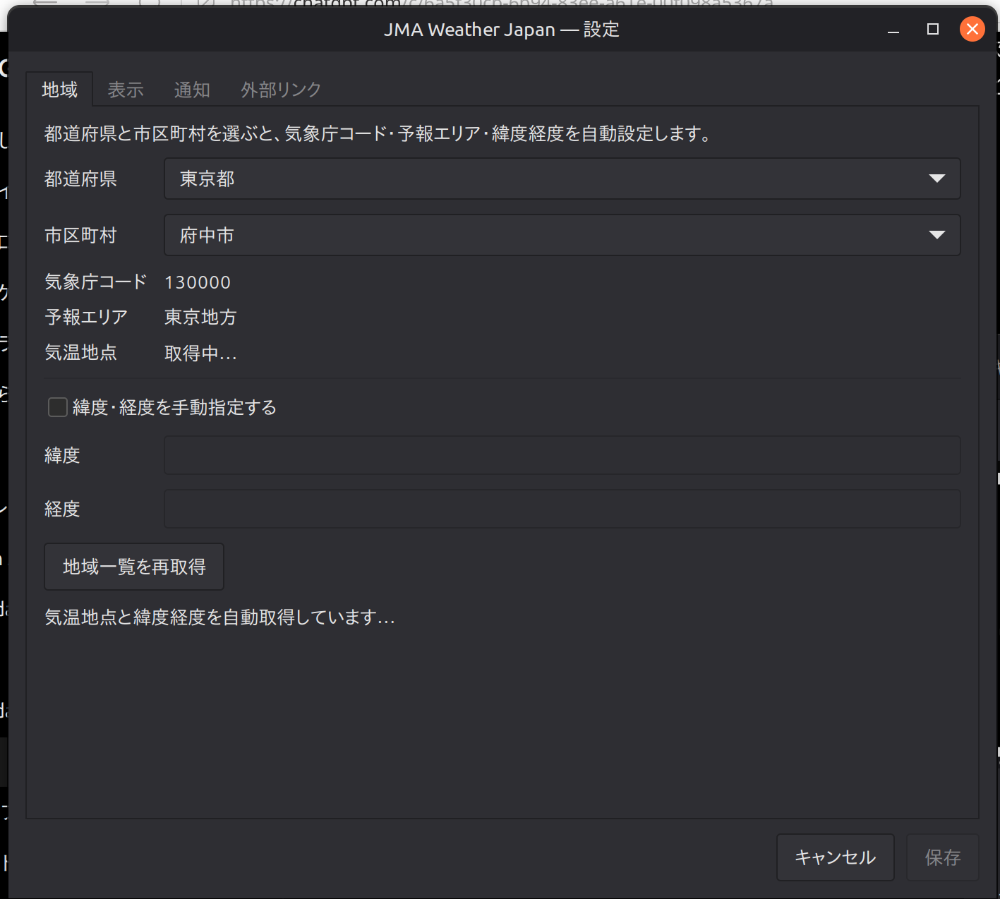

# JMA Weather Widget for Cinnamon 3.3.1

<p align="center">
  
</p>

気象庁の公式予報とOpen-Meteoの補助データを表示する、Linux上のCinnamon desktop environment向け天気アプレットです。

## スクリーンショット




> **正式版:** `3.3.1`では、v3.3.0の防災情報を維持したまま設定画面をv3.2.0仕様へ戻しました。

## v3.3.1の主な変更

- 設定画面とsettings schemaをv3.2.0と同じ構成へ戻しました
- 防災通知は新しい設定項目を増やさず、内部defaultで有効です
- 気象庁の注意報、警報、危険警報、特別警報を設定市区町村に対応させて表示します
- 注意報は`⚠`、警報以上は`🚨`でパネルへ簡潔に表示します
- 新規に発表された防災情報だけを通知し、継続情報を重複通知しません
- alert取得失敗を通常天気Providerから分離します
- 降水確率が0%なら数値を残し、パネルとOpen-Meteo時間別表示の傘だけを隠します
- 欠損値や0～100の範囲外を0%として扱いません

既存の設定画面、天気キャッシュschema、UUID、パネル設定、通知、障害時継続表示、更新世代管理は維持されます。通常利用では単体の`gjs` CLIは不要です。

## v3アーキテクチャ

巨大化していた`applet.js`から、データ取得・解析・統合処理をProvider／Service／Modelへ分離しました。

```text
applet.js
    ↓
WeatherService
    ├── JmaProvider
    └── OpenMeteoProvider
AlertService
    └── JmaAlertProvider
            ↓
      WeatherSnapshot
            ↓
      Cinnamon UI・通知処理
```

## ディレクトリ構成

```text
settings.py
├── tools/
│   └── location_catalog.py
├── data/
│   └── area-fallback.json
└── src/
    ├── models/
    │   └── weatherData.js
    ├── providers/
    │   ├── jmaProvider.js
    │   ├── jmaAlertProvider.js
    │   └── openMeteoProvider.js
    ├── services/
    │   ├── cacheService.js
    │   ├── alertCacheService.js
    │   ├── alertService.js
    │   ├── httpClient.js
    │   ├── iconService.js
    │   ├── locationService.js
    │   └── weatherService.js
    └── utils/
        └── weatherUtils.js
icons/
└── *.svg
```

## 機能

- 気象庁の公式JSONによる地域・今日・明日・週間予報
- 気象庁の現行警報JSONによる市区町村単位の防災情報
- 気象庁の降水確率を元の時間帯単位で表示
- Open-Meteoによる現在推定値・時間別予報・UV・体感温度・降水量・風
- 降水確率だけに依存しない雨アイコン
- 現在時間の時間別予報に同期したパネルアイコンと降水確率
- 3～12時間分の時間別表示
- 新規警報・注意報、雨、高温、UV通知
- API片方の取得に失敗した場合、もう片方と前回成功データを維持
- last-goodデータの永続キャッシュと起動時即時復元
- Providerごとの鮮度表示とキャッシュのみ状態での通知抑制
- 更新世代管理による多重通信・古い応答の反映防止
- timeout・HTTP・JSON・通信・解析エラー分類
- 都道府県・市区町村の連動選択
- 気象庁コード・予報エリア・緯度経度の自動設定
- 緯度経度の任意手動上書き
- 設定画面起動の互換フォールバック
- 同梱SVGによるパネル・現在・時間別・週間予報アイコン
- SVG欠損時のテーマアイコンフォールバック
- 現在天気・予報アイコンサイズ設定

## インストール

```bash
unzip jma-weather-widget-for-cinnamon-v3.3.1-github-ready.zip
cd jma-weather-widget-for-cinnamon-v3.3.1-github
./install.sh
```

通常利用のために`gjs`コマンドを追加インストールする必要はありません。将来はCinnamon Spicesからの導入も予定しています。

X11ではCinnamonを再読み込みします。

```text
Alt+F2
r
Enter
```

古いコードが残る場合は、パネルからアプレットを一度外して再追加してください。

## v3.3.0からの更新

アップグレードZIPを展開済みv3.3.0へ重ねてから再インストールします。v3.3.0で保存された追加の通知設定値が残っていても無視され、設定画面はv3.2.0と同じ構成になります。

```bash
unzip jma-weather-widget-v3.3.1-upgrade-from-v3.3.0.zip -d /path/to/jma-weather-widget-for-cinnamon
cd /path/to/jma-weather-widget-for-cinnamon
./install.sh
```

## キャッシュ保存先

```text
~/.cache/jma-weather@10yendama.com/weather-<instance-id>.json
~/.cache/jma-weather@10yendama.com/alerts-<instance-id>.json
```

`XDG_CACHE_HOME`が設定されている場合は、その配下へ保存されます。防災情報cacheは10分で失効し、cacheまたは通信失敗時は「現在状態未確認」と明示して、パネル記号と通知を抑制します。

## 開発者向けチェック

完全なテストには`gjs` CLIが必要です。これは開発時だけの依存関係です。

Ubuntu / Linux Mint:

```bash
sudo apt install gjs
```

```bash
./test.sh
```

実行内容:

- 全JavaScriptファイルの構文検査
- JSON検査
- Provider・WeatherSnapshotのスモークテスト
- alert code、severity、status、地域対応、差分通知のテスト
- alert cacheの期限切れ、地域・インスタンス分離テスト
- 0%・欠損・範囲外の降水確率表示テスト
- 現在時間選択、日付変更、タイムゾーン、パネル値のResolverテスト
- CacheServiceの保存・復元・期限切れ・破損キャッシュテスト
- Provider部分障害・全障害のレジリエンステスト
- 更新世代管理とエラー分類の静的検査
- SVG XML検査とIconServiceマッピングテスト
- 地域カタログ解析のスモークテスト
- Python設定画面の構文検査
- 正式版バージョン表記の整合性検査
- GJSでのモジュール読み込み検査
- インストールとローカル／CI依存分岐の検査

GitHub Actionsでも同じテストを実行します。リリース成果物は、比較元タグを指定して一括生成・検証できます。

```bash
tools/build-release.sh --base-tag v3.3.0
```

成果物は既定で`dist/`へ出力されます。スクリプトはGitHub-ready ZIPの展開後テスト、upgrade ZIPとGit binary patchの適用比較、禁止ファイル検査、SHA256照合まで実行します。

## 対応環境

- Linux上のCinnamon desktop environment
- Tested on Linux Mint / Cinnamon 6.6 / GJS 1.80 / X11

## データソース

- 現在の推定値・時間別予報: Open-Meteo
- 地域予報・時間帯降水確率・週間予報: 気象庁
- 警報・注意報: 気象庁防災情報 `warning/data/r8` JSON

警報JSONは気象庁ホームページ自身が表示に利用する公式配信データです。公開仕様として保証される気象庁防災情報XMLとは異なりURL・形式が予告なく変わる可能性があります。JWAは取得時刻と発表時刻を表示しますが、緊急時は気象庁、自治体、防災機関の公式情報も確認してください。

## ログ確認

```text
Alt+F2 → lg → Enter
```

または:

```bash
journalctl --user -f | grep -i jma-weather
```

## License

MIT
